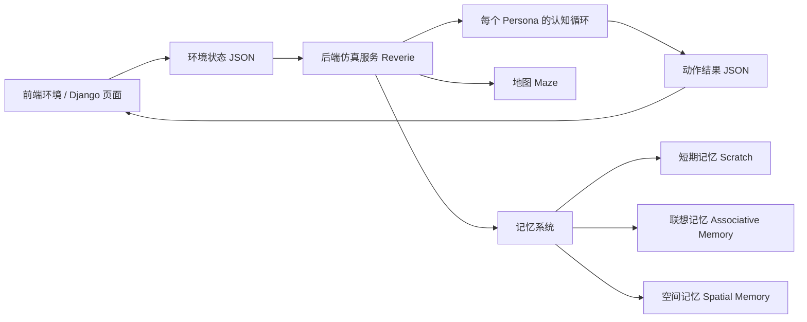
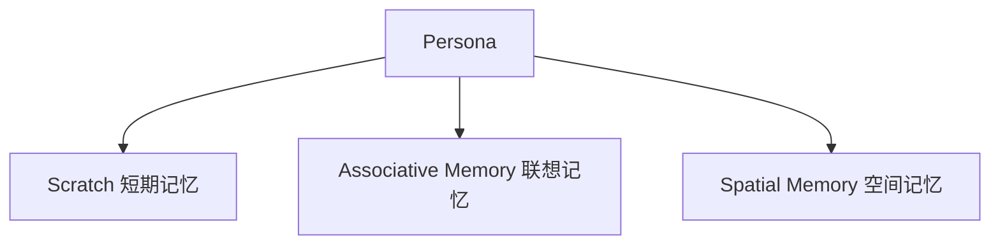
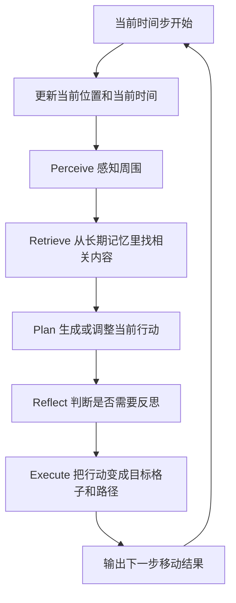
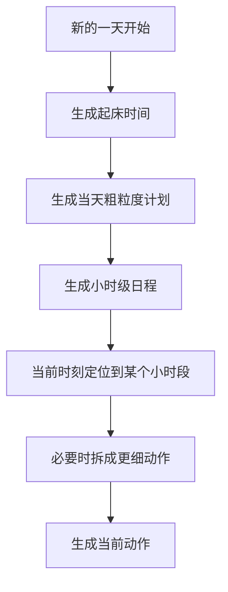
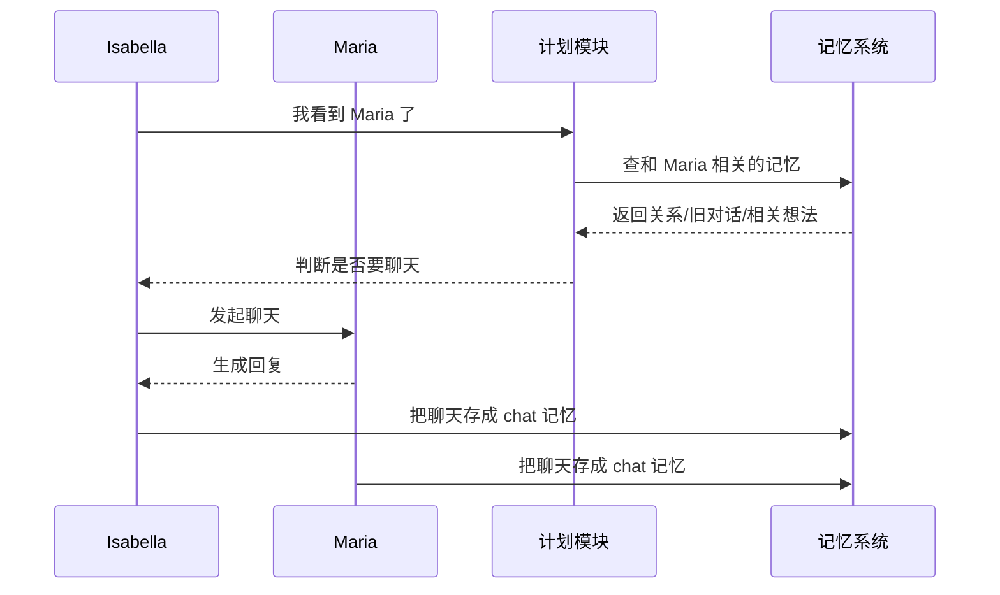
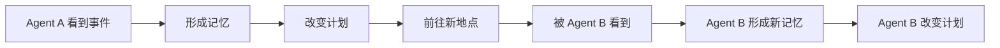
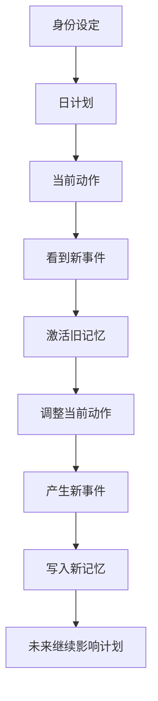

# Agent 小镇教学文档

这份文档面向第一次接触这个项目的人。

目标不是用学术语言解释论文，而是用尽量直白的话回答 4 个问题：

1. 这个 Agent 小镇到底是什么
2. 一个 Agent 每一步是怎么“想”和“动”的
3. 多个 Agent 为什么会在小镇里表现得像在“生活”
4. 这套设计在当前代码里分别落在哪些位置

---

## 1. 先用一句人话概括

这个项目可以理解成：

“把一群带记忆、带日程、会观察周围、会根据记忆做决定的角色，放进一个可走动的地图里，然后让他们每隔一小步就重新观察、回忆、计划、行动，于是整个小镇就会慢慢出现看起来像真实生活的行为。”

它不是：

- 不是一个大模型一次性把整天剧情全写出来
- 不是纯规则脚本让 NPC 按固定路线走
- 不是传统游戏里只会巡逻的状态机 NPC

它更像是：

- 地图系统：负责“世界长什么样”
- 记忆系统：负责“角色记得什么”
- 决策系统：负责“角色下一步做什么”
- 交互系统：负责“角色之间会不会聊天、会不会彼此影响”

---

## 2. 先看整体架构

### 2.1 整个系统由哪几部分组成

你可以把它想成一个“回合制但表现成连续动画”的系统：

- 前端把当前世界状态发给后端
- 后端让每个 agent 思考一轮
- 后端把每个 agent 下一步的动作写回去
- 前端把这些动作画出来

虽然画面看起来像连续模拟，但本质上它是一小步一小步推进的。

### 2.2 代码里的位置

- 世界地图：`reverie/backend_server/maze.py`
- 仿真主控：`reverie/backend_server/reverie.py`
- Agent 类：`reverie/backend_server/persona/persona.py`
- 感知：`reverie/backend_server/persona/cognitive_modules/perceive.py`
- 检索：`reverie/backend_server/persona/cognitive_modules/retrieve.py`
- 计划：`reverie/backend_server/persona/cognitive_modules/plan.py`
- 反思：`reverie/backend_server/persona/cognitive_modules/reflect.py`
- 执行：`reverie/backend_server/persona/cognitive_modules/execute.py`
- 前端交互入口：`environment/frontend_server/translator/views.py`

---

## 3. 先别急着看代码，先看“现实类比”

如果把一个 Agent 当成一个小镇居民，比如 “Isabella”，那她每一小步大概都在做这几件事：

1. 看看周围发生了什么
2. 想起一些和当前情况有关的旧事
3. 结合今天的安排，决定现在该做什么
4. 如果刚刚发生的事很重要，再形成一些新的想法
5. 朝目的地走一步

这就是整个系统最核心的设计。

### 3.1 对应成一句更短的话

**看见 -> 想起 -> 决定 -> 记住 -> 行动**

这五个动作不断重复，角色就会显得“有连续性”。

---

## 4. 一个 Agent 到底有哪些“脑内组件”

一个 Persona 不是只有一个 prompt。

它有三种很重要的记忆。

### 4.1 Scratch：短期记忆

它保存的是“眼下正在发生什么”。

例如：

- 我现在几点了
- 我现在站在哪个格子上
- 我今天的大致计划是什么
- 我当前正在执行什么动作
- 我要去哪里
- 我正在和谁聊天
- 我已经规划好的路径是什么

你可以把它理解成一个人的“工作记忆”或者“当前状态栏”。

### 4.2 Associative Memory：联想记忆

它保存的是“过去经历过的事情”和“由事情产生的想法”。

里面主要有三类内容：

- event：事件
- thought：想法
- chat：对话

比如：

- “Maria 正在吃早餐”
- “昨天我和 Maria 聊过画展”
- “我觉得 Maria 最近很忙”

这个记忆不是简单日志，它还会给每条记忆配上：

- 创建时间
- 重要性分数
- 关键词
- 向量 embedding

这样后面才能做“相关记忆检索”。

### 4.3 Spatial Memory：空间记忆

它保存的是“我知道这个世界里有什么地方、地方里有什么物体”。

比如：

- 这个世界里有 `Johnson Park`
- 公园里有 `park garden`
- 花园里有某些物体

你可以把它理解成角色对地图的认知树。

---

## 5. 一个 Agent 的完整思考循环

这是整个系统最关键的一张图。

在代码里，这条主链几乎直接写在 `persona.py` 的 `move()` 里。

---

## 6. 用一个完整例子来理解一轮循环

下面我们用一个简化例子解释。

### 6.1 场景设定

假设当前时间是早上 8:10。

Isabella 的今日计划大致是：

- 8:00 吃早餐
- 9:00 去画室画画
- 中午吃饭

此时她正在家附近活动，视野里看到了 Maria。

### 6.2 第一步：Perceive 感知

系统先看 Isabella 附近几个格子里发生了什么。

它会做两件事：

1. 记住附近的空间结构
2. 记住附近的新事件

例如她看到了：

- 厨房
- 餐桌
- Maria
- “Maria 正在吃早餐”

注意，不是所有东西都看。

代码里有两个限制：

- `vision_r`：视野半径
- `att_bandwidth`：注意力带宽

意思是：

- 只能看见一定范围内的东西
- 就算范围里东西很多，也只挑最近、最值得注意的一部分

这就像现实里的人不会同时注意到整个城市所有事情。

### 6.3 第二步：把看到的新事存进记忆

如果 Isabella 发现：

- “Maria 正在吃早餐”

而这个事件不是她最近刚记过的重复事件，那么系统就会把它存进联想记忆。

这个记忆会带上：

- 事件描述
- 关键词
- embedding
- 重要性分数

为什么要存？

因为以后再看到 Maria、早餐、厨房、聊天之类的事情时，这段记忆就能被调出来。

### 6.4 第三步：Retrieve 检索相关记忆

现在 Isabella 不只是“看到 Maria”，系统还会问：

“过去有哪些和这个当前事件相关的记忆？”

比如它可能找到：

- 昨天 Maria 说今天很忙
- 上次早餐时两人聊过画展
- Isabella 觉得 Maria 人不错

这里的关键思想是：

**角色不是只根据当前画面行动，而是根据当前画面 + 过去记忆行动。**

这就是它比普通脚本 NPC 更像人的地方。

### 6.5 第四步：Plan 计划

计划模块会同时考虑两类事情：

1. 我今天原本打算做什么
2. 我刚刚看到的事情要不要让我临时改变一下

所以 Isabella 此时可能有两种方向：

- 按原计划继续吃早餐，然后去画室
- 因为看见 Maria，而决定先聊几句

系统不是每一步都重新发明人生目标。

它通常先有一个“当天大纲”，再在当前时刻做局部调整。

---

## 7. “计划”为什么是这个系统里最重要的一层

很多人第一次看这个项目会误以为：

“是不是每一步都把当前情况丢给 LLM，让它直接输出下一步动作？”

其实不是。

这个系统在计划层做了两级结构。

### 7.1 长期计划：今天要怎么过

在新的一天开始时，系统会先生成：

- 起床时间
- 一天的大致安排
- 再把大致安排展开成小时级日程

可以理解成：

- 大计划：今天我要干什么
- 小计划：这个小时我要干什么

比如：

- 7:00 起床洗漱
- 8:00 吃早餐
- 9:00 到 12:00 画画
- 12:00 吃午饭

### 7.2 短期计划：当前这一刻具体做什么

当轮到 Isabella 当前这一小步时，系统会问：

- 现在已经到日程里的哪一段了
- 这一段有没有必要进一步拆分
- 当前有没有突发社交事件需要临时插入

例如：

“做早晨例行活动” 这个动作太粗了，就可能被拆成：

- 去洗手间
- 换衣服
- 吃早餐
- 收拾画具

所以它不是一句“morning routine”从 8:00 走到 9:00。

它会逐步细化。

### 7.3 用图看长期计划和短期计划的关系

---

## 8. 为什么 Agent 会“临时改变原计划”

这一步是很多人觉得它“像活的”的关键。

假设 Isabella 原本计划：

- 8:10 继续吃早餐

但她看见 Maria 也在附近。

系统会进一步判断：

- 现在适合聊天吗
- 两人是不是都没在睡觉
- 两人是不是已经在聊天
- 两人是不是刚聊过，应该先冷却一下
- LLM 会不会判断她们此时愿意聊天

如果这些条件成立，原来的日程就可能被插队。

也就是说：

**长期计划不是死板命令，而是会被当前社会情境临时覆盖。**

这很重要，因为现实中的人也会这样。

例如：

- 你原本去上班路上
- 突然在楼下遇到熟人
- 你停下来聊 2 分钟

这个项目就是在模拟这种“原计划 + 临时响应”的混合行为。

---

## 9. 聊天是怎么发生的

如果一个 Agent 想和另一个 Agent 聊天，系统不会只写一句“他们聊天了”，而是会真的生成一段对话。

流程大概是这样：

### 9.1 举个直白例子

Isabella 看到 Maria 在厨房。

系统可能检索到：

- 前天两人聊过画展
- Maria 最近有点忙

于是 Isabella 更可能说：

“你今天还去画室吗？”

而不是随机说：

“天气真不错。”

这就是“记忆参与对话”的意义。

### 9.2 聊天后会发生什么

聊天结束后，系统还会继续产生新的 thought，例如：

- “和 Maria 聊完后，我觉得她今天有点焦虑。”
- “这次对话提醒我下午也许该去找她。”

所以聊天不是一次性输出，它还会反过来改写角色未来的记忆和计划。

---

## 10. Reflect 反思到底是什么

如果只让角色记录事件而不做反思，它就很像流水账。

反思模块的作用是：

**把许多零散事件，提炼成更抽象、更稳定的想法。**

### 10.1 举例说明

假设 Isabella 这几小时里经历了这些事：

- 看到 Maria 一直很忙
- 和 Maria 聊天时感觉她压力大
- Maria 匆匆离开去工作

如果只是存事件，记忆里会有三条日志。

但反思后，系统可能生成一个 thought：

- “Maria 最近工作压力很大。”

这条 thought 比单条事件更抽象，也更容易影响后续决策。

### 10.2 为什么需要反思

因为人在生活里不是只保存录像，而是会总结。

比如现实里你不会只记得：

- 3 月 1 日她皱眉
- 3 月 2 日她很急
- 3 月 3 日她没空聊天

你更可能形成一句总结：

- “她最近状态不太好。”

这个系统就是在试图模拟这种从事件到观点的过程。

### 10.3 反思何时触发

它不是每一步都反思。

当前代码里更像是：

- 当新经历积累到一定“重要性阈值”
- 就触发一次集中反思

这样可以避免每走一步都大总结，成本太高，也不自然。

---

## 11. Execute 执行为什么也很关键

很多文字型 agent 系统到“决定做什么”就结束了。

但这个项目还要多做一步：

**把“想做什么”变成“走到地图上的哪个格子”。**

### 11.1 举个例子

假设计划模块决定：

- Isabella 要去厨房吃早餐

这还不够。

执行模块还要继续做：

1. 找到“厨房”对应哪些 tile
2. 从里面挑一个合适的目标格子
3. 算出从当前位置走过去的路径
4. 每个时间步只向前迈一格

所以 agent 的移动不是瞬移，而是一步一步走过去。

### 11.2 为什么这让系统更像“世界”

因为角色不是凭空切换场景，而是真的受地图约束。

例如：

- 中间有碰撞格，不能穿墙
- 两个人要去同一个地方，可能会尽量分开站
- 如果对象是另一个 persona，系统会先算出朝对方靠近的路径

这让“社交”和“生活”真正发生在同一个空间里，而不是只在文本里发生。

---

## 12. 为什么多个 Agent 放在一起后，会出现“小镇感”

这是很多人最感兴趣的部分。

### 12.1 因为每个 Agent 都不是孤立随机体

每个角色都同时受到三类东西约束：

1. 自己的身份
2. 自己的计划
3. 自己的记忆

所以不同角色会长期表现出不同风格。

例如：

- 有人更爱社交
- 有人更宅
- 有人会规律工作
- 有人会更频繁地因为别人而改变日程

### 12.2 因为他们共享同一个空间

大家都在同一张地图里活动，所以会有：

- 偶遇
- 同处一个房间
- 路径交叉
- 同时看到同一个事件

这就是很多社会现象的基础。

### 12.3 因为记忆会传播影响

假设发生了一件事：

- Maria 告诉 Isabella，下午公园有活动

后面可能会出现：

- Isabella 记住了这件事
- Isabella 下午真的去公园
- 她又在那里遇见别人

于是一个信息通过记忆和行动扩散开来。

这就形成了“涌现行为”的味道。

### 12.4 用图看多 Agent 的影响链

这条链一旦在多人系统里不断叠加，就会出现：

- 聚集
- 社交传播
- 时间上连贯的小故事
- 看起来像“镇上今天发生了什么”

---

## 13. 这个系统为什么“看起来聪明”，但本质上不是万能智能

这里很值得说清楚。

### 13.1 它强在“连续性”

它最强的不是：

- 单次推理特别深
- 世界模型特别精确

它强在：

- 能连续生活
- 能把前后经历串起来
- 能用记忆影响未来行为

### 13.2 它不是全知的

每个 Agent 只知道：

- 自己看见的局部环境
- 自己记住的过去

它并不知道全地图每一刻发生了什么。

这点很重要，因为这让角色更像人，而不像“上帝视角脚本”。

### 13.3 它也不是完全自由的

它还是受到很多框架限制：

- 地图限制
- 时间步推进
- 注意力带宽
- 预先设定的人设
- LLM 输出格式要求

所以它更像：

“在一个半结构化世界里，被记忆和规划驱动的角色系统”

而不是无限自由的通用智能体。

---

## 14. 用“上班族的一天”做一个从早到晚的完整例子

下面用一个更长的例子，把整套原理串起来。

### 14.1 早晨：生成当日计划

新的一天开始，系统为 Agent 生成：

- 起床时间：7:00
- 今日计划：
  - 7:00 洗漱
  - 8:00 吃早餐
  - 9:00 到 12:00 工作
  - 12:00 吃午饭
  - 下午继续工作

这时 Agent 还没有真的动，只是有了一份“今天大概要怎么过”的框架。

### 14.2 8:05：开始执行早餐计划

系统定位到当前时间属于“吃早餐”这段。

如果动作太粗，就拆细：

- 去厨房
- 坐下
- 吃早餐

然后根据地图找到厨房和餐桌对应的目标位置，开始走过去。

### 14.3 8:10：在厨房看见熟人

Agent 在厨房附近看见另一个 Agent。

系统把这件事存成记忆，再检索过去与此人相关的事件和想法。

如果判断适合聊天，就可能暂停原行动，插入一段对话。

### 14.4 8:20：对话结束，形成新想法

Agent 不只记住了聊天内容，还可能形成新的 thought：

- “对方今天状态不太好”
- “下午可以再去找她”

这些 thought 以后会继续影响行动。

### 14.5 中午：按原计划回到工作流

如果没有新的突发事件，Agent 会回到自己的日程主线。

这就是为什么角色既有“生活规律”，又有“偶发偏离”。

### 14.6 晚上：多次重要事件触发反思

如果今天经历了很多重要事件，系统可能触发反思，总结出更抽象的认识。

例如：

- “我最近工作压力大”
- “Maria 需要帮助”

这类 thought 会留在长期记忆里，影响明天甚至更久的行为。

---

## 15. 你可以把整个系统看成三层因果链

这张图很重要。

它说明这个项目的“像人”不是魔法，而是靠下面这件事实现的：

**过去影响现在，现在又变成未来的过去。**

只要这条链不断闭环，角色就会越来越像一个持续存在的人，而不是一组离散命令。

---

## 16. 对照源码时，你最该重点看的文件

如果你想从“懂原理”进一步到“能读代码”，建议按这个顺序看：

### 第一步：看入口

- `reverie/backend_server/persona/persona.py`

这里最重要，因为 `move()` 直接把认知链串起来。

### 第二步：看一轮仿真怎么跑

- `reverie/backend_server/reverie.py`

这里负责：

- 读取环境状态
- 让每个 Persona 思考
- 写出 movement 结果

### 第三步：看地图和空间

- `reverie/backend_server/maze.py`
- `reverie/backend_server/path_finder.py`

这里决定：

- 哪些地方能走
- 哪些地方是什么房间、什么物体
- 角色如何规划路径

### 第四步：看认知模块

- `perceive.py`
- `retrieve.py`
- `plan.py`
- `reflect.py`
- `execute.py`

这 5 个文件正好对应 “看见 -> 想起 -> 决定 -> 总结 -> 行动”。

### 第五步：看三种记忆

- `scratch.py`
- `associative_memory.py`
- `spatial_memory.py`

这几份代码会帮助你理解：

- 什么状态是临时的
- 什么记忆会长期保存
- 什么知识和地图有关

---

## 17. 初学者最容易误解的 6 件事

### 误解 1：Agent 小镇就是很多 prompt 并排调用

不对。

真正关键的是：

- 有状态
- 有记忆
- 有连续时间
- 有共同空间

没有这些，只是“很多 prompt”而已。

### 误解 2：Agent 每一步都重新思考整个人生

不对。

大多数时候它只是：

- 沿着今天的计划继续走
- 遇到事件时再局部调整

### 误解 3：记忆只是日志

不对。

记忆还参与：

- 检索
- 重要性判断
- embedding 相似度匹配
- 后续计划调整

### 误解 4：社交是预先写死的

不完全对。

系统有规则约束，但是否聊天、聊什么，会受到当前情境和记忆影响。

### 误解 5：执行只是移动动画

不对。

执行层把抽象意图和真实地图连接起来，这是系统能“落地”的关键。

### 误解 6：这个系统模拟了真正的人类心智

也不对。

它是在工程上近似模拟：

- 注意
- 回忆
- 计划
- 反思
- 社交

是一个“有启发意义的认知架构原型”，不是完整人类心智复制品。

---

## 18. 最后做一个极简总结

如果你只记 5 句话，记这 5 句就够了：

1. Agent 小镇 = 地图世界 + 多个带记忆的角色 + 时间步推进。
2. 每个角色每一步都在做：感知、检索、计划、反思、执行。
3. 角色不是只看当前画面，而是会把过去记忆带进当前决策。
4. 角色既有当天计划，也会被突发社交事件临时改道。
5. 多个角色共享地图并互相写入彼此记忆，所以会逐渐涌现出“小镇生活感”。

---

## 19. 如果你接下来想继续深入，推荐的学习顺序

### 路线 A：先懂运行机制

适合想先把项目跑起来的人。

顺序建议：

1. 看 `README.md`
2. 看 `reverie.py`
3. 看 `views.py`
4. 理解 `storage/` 和 `movement/` 里的 JSON

### 路线 B：先懂 Agent 脑子怎么工作

适合想研究架构的人。

顺序建议：

1. 看 `persona.py`
2. 看 `scratch.py`
3. 看 `perceive.py`
4. 看 `retrieve.py`
5. 看 `plan.py`
6. 看 `reflect.py`
7. 看 `execute.py`

### 路线 C：先懂为什么会涌现出“小镇故事”

适合想研究 multi-agent 行为的人。

顺序建议：

1. 看计划模块里的聊天与反应逻辑
2. 看联想记忆如何写入和检索
3. 看聊天结束后如何生成新 thought
4. 看多角色在共享地图里如何互相影响

---

## 20. 一句话收尾

这个项目最值得学的地方，不是某一个 prompt 怎么写，而是它把下面这些东西接在了一起：

**记忆、时间、空间、计划、社交。**

也正因为这几样被接起来了，角色才不再像单次回答问题的模型，而开始像“住在小镇里、会持续生活的人”。
