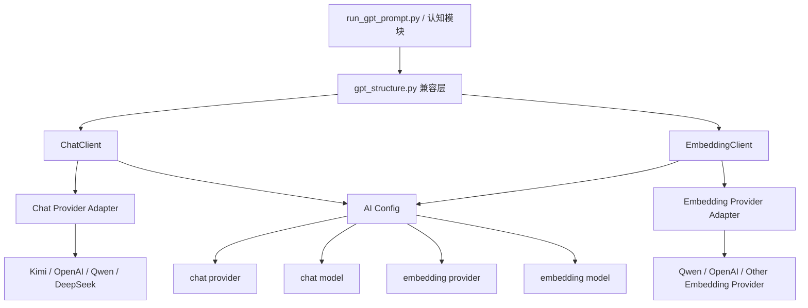

# Agent 小镇 AI 架构优化方案

本文档聚焦于当前 `generative_agents` 项目中 **与 AI 能力相关的部分** 的优化方案。

这里的“优化”指的是：

- 让对话模型供应商可切换
- 让 Embedding 模型可切换
- 让配置、密钥、模型选择、向量能力更清晰
- 让旧代码在尽量少改业务逻辑的前提下更容易维护

这里的“优化”**不**意味着：

- 不把 Agent 小镇重构成 Unity 工程
- 不照搬 SceneBlueprint 的整体架构
- 不改造地图、Django、仿真循环、角色记忆结构的业务含义
- 不改变论文原型的核心行为机制

换句话说，这是一份 **面向当前 Python 仓库的 AI 子系统优化方案**，而不是跨项目框架迁移方案。

---

## 0. 当前实现进度

截至当前分支，这份方案中的部分内容已经落地：

- 阶段 1：`ChatClient + EmbeddingClient + gpt_structure.py 兼容层` 已完成
- 阶段 1.5：Qwen chat / embedding 自检与 `run_gpt_prompt.py` 代表性业务链验证已完成
- 阶段 2：simulation embedding 元信息写入与混用保护已完成
- 阶段 3：simulation embeddings 重建脚本已完成，并已用真实 Qwen embedding 接口验证
- 阶段 4：AI 运行态审计与 simulation 检查工具已完成

当前默认接入策略为：

- chat provider: Qwen（DashScope compatible chat）
- embedding provider: Qwen `text-embedding-v4`

当前默认保护策略为：

- `embedding_mixing_policy = "forbid"`

也就是：

- 如果 simulation 保存的 embedding 来源与当前运行配置不一致
- 系统会拒绝继续运行，避免不同向量空间被无感混用

---

## 1. 背景与目标

当前 Agent 小镇的核心行为机制仍然成立：

- 世界地图 `maze.py`
- 角色主循环 `persona.py`
- 感知、检索、计划、反思、执行五个认知模块
- Django 前端 + 仿真后端的文件同步机制

这些部分的整体设计暂时不需要推翻。

真正需要优化的是 AI 调用层。

当前代码中，AI 相关能力主要集中在：

- `reverie/backend_server/persona/prompt_template/gpt_structure.py`
- `reverie/backend_server/persona/prompt_template/run_gpt_prompt.py`
- 少量直接调用 `ChatGPT_single_request(...)` 的逻辑

当前问题并不在“是否能调用大模型”，而在于：

1. 供应商绑定过死
2. Chat 与 Embedding 没有独立抽象
3. 旧版 OpenAI SDK 调用方式与模型命名混杂
4. 配置能力不足，不利于切换 Kimi / Qwen / OpenAI / DeepSeek 等
5. Embedding 和记忆存档之间缺少版本边界

本方案的目标是：

**在不破坏 Agent 小镇行为主链的前提下，把 AI 调用层优化成“可切换聊天模型 + 可切换 Embedding 模型 + 可追踪向量版本”的结构。**

---

## 2. 当前现状分析

### 2.1 当前 AI 调用入口

当前项目的 AI 能力主要由 `gpt_structure.py` 承担：

- `ChatGPT_single_request(prompt)`
- `ChatGPT_request(prompt)`
- `GPT4_request(prompt)`
- `safe_generate_response(prompt, gpt_parameter, ...)`
- `get_embedding(text, model="text-embedding-ada-002")`

上层 `run_gpt_prompt.py` 中大量 prompt 任务通过这些函数间接调用模型。

### 2.2 当前实现的典型特征

当前实现具有以下典型特征：

1. **对 OpenAI SDK 直连**

   - `import openai`
   - `openai.api_key = openai_api_key`
   - `openai.ChatCompletion.create(...)`
   - `openai.Completion.create(...)`
   - `openai.Embedding.create(...)`
2. **同时混用两类生成接口**

   - Chat Completions 风格
   - Legacy Completions 风格（`text-davinci-*`）
3. **Embedding 写死为 OpenAI 风格**

   - `get_embedding(...)` 直接依赖 OpenAI Embedding API
4. **上层业务感知到底层供应商细节**

   - 业务逻辑里到处出现 `gpt-3.5-turbo`、`gpt-4`、`text-davinci-003`

### 2.3 当前设计的问题

#### 问题 1：供应商切换成本过高

如果要从 OpenAI 切到 Kimi 或 Qwen，当前不是改一处，而是要同时处理：

- ChatCompletion.create
- Completion.create
- Embedding.create
- 旧模型名
- prompt 包装函数

#### 问题 2：Chat 与 Embedding 耦合在一起

当前代码默认隐含一个前提：

“聊天模型和 Embedding 模型都来自同一个供应商，并且都走同一种 SDK 风格。”

这个前提在现实中通常不成立。

例如未来很可能出现：

- Chat 选 Kimi
- Embedding 选 Qwen text-embedding-v4

#### 问题 3：旧 Completion 路径会阻碍兼容

Kimi、Qwen、DeepSeek 等很多现代服务虽然提供 OpenAI 兼容接口，但兼容重点通常在：

- `chat/completions`

而不是：

- `Completion.create(text-davinci-003)`

因此当前 legacy 路径是迁移阻力，而不是资产。

#### 问题 4：Embedding 没有版本边界

Agent 小镇的 Embedding 不是临时搜索缓存，而是角色长期记忆的一部分。

相关数据会落到：

- persona 的 associative memory
- simulation 存档中的 `embeddings.json`

这意味着：

**Embedding 模型一旦切换，旧存档中的向量空间可能失效。**

如果不显式记录向量来源，后续很容易发生：

- 新模型计算的 query 向量
- 去匹配旧模型生成的 memory 向量

结果就是检索语义漂移，甚至完全失真。

---

## 3. 优化原则

本次优化遵循以下原则。

### 原则 1：只优化 AI 子系统，不碰仿真主链

不修改以下核心业务含义：

- `Persona.move()` 主循环
- 感知 / 检索 / 计划 / 反思 / 执行的认知链
- `Maze`、路径规划、环境 JSON 同步机制
- Django 页面与 storage 目录结构

### 原则 2：先抽象调用层，再谈换模型

先把结构理顺，再切 Kimi 或其他模型。

顺序不能反过来。

因为如果底层结构不先解耦，换任何新供应商都只会把技术债继续扩大。

### 原则 3：聊天模型与 Embedding 模型必须分离

这一点是本方案的核心。

目标状态应当允许：

- `chat = Kimi`
- `embedding = Qwen`

或：

- `chat = OpenAI`
- `embedding = OpenAI`

或：

- `chat = DeepSeek`
- `embedding = local / OpenAI / Qwen`

### 原则 4：尽量保持上层 prompt 代码不动

`run_gpt_prompt.py` 中已经积累了大量 prompt 模板和输出校验逻辑。

这些内容虽然老，但它们承载了项目行为。

本次优化优先目标是：

- 不大规模改 prompt 业务代码
- 尽量只替换底层调用能力

### 原则 5：Embedding 迁移必须带版本管理

因为 Embedding 会进入长期记忆，所以不能只做“接口可切换”。

还必须让系统知道：

- 当前 simulation 的向量是谁算的
- 当前记忆是否允许和新的 embedding provider 混用

---

## 4. 目标架构

### 4.1 总体结构图



### 4.2 分层说明

#### 第 1 层：业务层

主要是：

- `run_gpt_prompt.py`
- `plan.py`
- `reflect.py`
- `perceive.py`

这层只表达业务意图，例如：

- 生成起床时间
- 生成日计划
- 生成对话
- 计算事件重要性

这层不应该直接知道底层供应商是谁。

#### 第 2 层：兼容层

由新的 `gpt_structure.py` 承担“旧接口兼容”责任。

它的职责不是直接调某个 SDK，而是：

- 让现有上层函数签名尽量还能用
- 内部把旧风格请求转发给新的 client

例如：

- `ChatGPT_request(...)` 内部委托给 `ChatClient`
- `get_embedding(...)` 内部委托给 `EmbeddingClient`
- `safe_generate_response(...)` 内部改为基于 chat 的兼容实现

#### 第 3 层：能力层	

新增两个核心组件：

- `ChatClient`
- `EmbeddingClient`

这两个类分别承担：

- 聊天生成
- 文本向量化

两者不再互相隐式耦合。

#### 第 4 层：Provider Adapter 层

这一层负责处理不同供应商的请求差异。

例如：

- Kimi / OpenAI 兼容 chat 接口
- Qwen DashScope 的 embedding 请求格式
- 响应 JSON 字段差异

---

## 5. 配置设计

### 5.1 配置目标

当前项目里 `utils.py` 更像一个手工配置文件。

优化后建议把 AI 配置拆成以下维度：

### 5.2 建议配置项

```python
# Chat
chat_provider = "moonshot"
chat_api_key = "..."
chat_base_url = "https://api.moonshot.cn/v1"
chat_model = "moonshot-v1-8k"

# Embedding
embedding_provider = "dashscope"
embedding_api_key = "..."
embedding_base_url = "https://dashscope.aliyuncs.com/api/v1/services/embeddings/text-embedding/text-embedding"
embedding_model = "text-embedding-v4"

# Behavior
embedding_mixing_policy = "forbid"
request_timeout_sec = 60
debug_llm = True
```

### 5.3 为什么要拆成 base_url 而不是完整 api_url

因为当前 Python 项目最好保留统一接口语义，例如：

- chat client 自己决定拼 `/chat/completions`
- embedding client 自己决定拼 `/embeddings` 或 provider 特定路径

这样更利于底层 adapter 处理差异。

如果直接写完整 endpoint，也可以做，但长期容易把 provider 细节泄漏到配置层。

### 5.4 密钥存储建议

现阶段是研究原型项目，不需要像 Unity Editor 那样做完整 GUI 配置。

因此第一阶段建议：

- 仍然从 `utils.py` 或环境变量读取
- 但 chat key 和 embedding key 分开

后续如有需要，再做更成熟的配置持久化。

---

## 6. ChatClient 设计

### 6.1 职责

`ChatClient` 只负责：

- 发送 chat completion 请求
- 接收文本响应
- 返回统一格式的内容

它不负责：

- 业务 prompt 含义
- 业务校验逻辑
- simulation 存档

### 6.2 建议暴露接口

```python
class ChatClient:
    def complete(self, prompt: str, *, temperature: float = 0.7,
                 max_tokens: int | None = None,
                 stop: list[str] | None = None) -> str:
        ...
```

可选扩展：

```python
def complete_messages(self, messages: list[dict], **kwargs) -> str:
    ...
```

### 6.3 兼容策略

当前上层很多逻辑还是“给我一段 prompt 字符串”。

因此第一阶段不必强行把所有业务改成 messages 风格。

可以先统一成：

- system prompt 可选
- user content = 当前 prompt

即：

```json
[
  {"role": "user", "content": "<prompt>"}
]
```

### 6.4 为什么不先上复杂 tool calling

因为 Agent 小镇当前 AI 子系统的主要需求不是工具调用，而是：

- 稳定生成文本
- 稳定输出结构化可校验结果

因此本次优化不引入复杂 tool calling 能力，避免把问题扩大。

---

## 7. EmbeddingClient 设计

### 7.1 职责

`EmbeddingClient` 只负责：

- 把文本转成向量
- 屏蔽不同 provider 的请求格式差异

### 7.2 建议暴露接口

```python
class EmbeddingClient:
    def embed_text(self, text: str) -> list[float]:
        ...

    def embed_texts(self, texts: list[str]) -> list[list[float]]:
        ...
```

### 7.3 为什么必须支持批量接口

虽然当前 Agent 小镇最常见的是单条 `get_embedding(text)`，

但未来如果要：

- 重建某个 simulation 的全部 embeddings
- 批量迁移记忆

批量接口会非常重要。

### 7.4 Provider 差异处理

不同 provider 可能差异在：

- URL 结构不同
- 请求体字段不同
- 返回 JSON 不同
- 批量上限不同

因此 adapter 层至少需要负责：

- `build_embedding_request(provider, model, texts)`
- `parse_embedding_response(provider, json)`

这部分设计可以参考你在 Unity 里 `EmbeddingService.cs` 的做法，但不需要复制 Unity 的 Editor/UI 逻辑。

---

## 8. 兼容层设计：如何让旧 prompt 代码继续工作

### 8.1 为什么需要兼容层

`run_gpt_prompt.py` 中已经大量使用：

- `safe_generate_response(...)`
- `ChatGPT_safe_generate_response(...)`
- `ChatGPT_safe_generate_response_OLD(...)`

如果直接删掉这些函数，上层业务改动会非常大。

因此建议保留这些函数名，但内部实现重写。

### 8.2 建议做法

#### `ChatGPT_request(...)`

改成：

- 委托 `ChatClient.complete(...)`

#### `ChatGPT_single_request(...)`

改成：

- `ChatClient.complete(...)`

#### `GPT_request(...)`

不要再真的走 legacy completion。

可以改成：

- 将 `gpt_parameter` 中的信息适配到 chat 请求
- 忽略 `engine=text-davinci-*` 的旧含义
- 内部统一映射到当前 chat provider/model

也就是说：

`safe_generate_response(...)` 的“行为语义”保留，
但“底层 completion API”不再保留。

### 8.3 为什么这是必要的

因为现有 prompt 业务依赖的是：

- 文本输入
- 文本输出
- 重试
- validate / cleanup

而不是 OpenAI Completion API 本身。

所以保留行为，替换底层，是最小风险路径。

---

## 9. Embedding 与记忆存档的版本管理

这是本方案里最不能省略的一部分。

### 9.1 当前风险

当前 persona 的 associative memory 会保存 embeddings。

一旦未来：

- 旧存档用 `text-embedding-ada-002`
- 新请求改成 `text-embedding-v4`

就会出现：

- 新 query 向量和旧 memory 向量处在不同向量空间

这会直接损害检索质量。

### 9.2 建议引入的元信息

建议在 simulation 或 persona 级别新增 embedding metadata，例如：

```json
{
  "embedding_provider": "dashscope",
  "embedding_model": "text-embedding-v4",
  "embedding_schema_version": 1
}
```

### 9.3 建议保存位置

优先建议放在：

- simulation 的 `reverie/meta.json`

理由：

- 一次 simulation 通常应使用一致的 embedding 方案
- 读取 simulation 时最容易先看到这里

如有必要，也可以额外写入 persona memory 元数据。

### 9.4 建议策略

建议第一版采用最保守策略：

- `embedding_mixing_policy = forbid`

即：

- 如果当前配置的 embedding model 和 simulation metadata 不一致
- 则拒绝直接混用
- 给出明确错误或提示要求重建 embeddings

### 9.5 后续可选能力

未来可以增加：

- `rebuild_simulation_embeddings(sim_code, provider, model)`

用于把现有 simulation 中的 embeddings 全量重算。

---

## 10. 推荐的渐进式实施步骤

本次优化建议拆成 4 个阶段。

### 阶段 1：建立新客户端，不改业务语义

目标：

- 新增 `ChatClient`
- 新增 `EmbeddingClient`
- `gpt_structure.py` 内部改为委托这两个 client

这一步完成后：

- 上层 prompt 代码基本不动
- 但底层不再直接耦合 OpenAI SDK

当前状态：

- 已完成

### 阶段 1.5：完成默认供应商接入与业务链验证

目标：

- 用当前优先供应商完成真实联调
- 至少验证 chat 与 embedding 两条基础能力链
- 至少验证 `run_gpt_prompt.py` 中两条代表性业务链

当前实现：

- 当前优先接入为 Qwen，而不是 Kimi
- 已通过真实 API 调用验证：
  - chat completions
  - embeddings
  - `safe_generate_response(...)`
  - `ChatGPT_safe_generate_response(...)`

### 阶段 2：补充 embedding 元信息与混用保护

目标：

- 在 simulation meta 中记录 embedding provider / model / schema version
- 在加载 simulation 时校验当前 embedding 配置是否兼容
- 默认禁止不同 embedding 模型无感混用

当前实现：

- `reverie/meta.json` 在保存时会写入：
  - `embedding_provider`
  - `embedding_model`
  - `embedding_schema_version`
- 在 fork / 加载 simulation 时会进行兼容校验
- 对于历史老存档，如果缺少 metadata 但已经存在 embeddings，会按旧项目默认值推断为：
  - `openai`
  - `text-embedding-ada-002`
- 当当前配置与 simulation 期望不一致时，默认直接拒绝继续运行

### 阶段 3：完成 Embedding 重建与迁移工具

目标：

- 提供重建已有 simulation embeddings 的脚本或命令
- 支持在更换 embedding provider / model 后进行显式迁移

当前实现：

- 已新增脚本：
  - `reverie/backend_server/rebuild_simulation_embeddings.py`
- 当前脚本能力：
  - 遍历某个 simulation 下所有 persona 的 associative memory
  - 收集 `nodes.json` 与现有 `embeddings.json` 中的 `embedding_key`
  - 使用当前运行配置的 embedding provider/model 重新批量生成向量
  - 覆盖写回新的 `embeddings.json`
  - 首次执行时保留 `embeddings.json.bak`
  - 自动把 `reverie/meta.json` 更新到当前 embedding 元信息
  - `--dry-run` 时只统计将要重建的 key 数量，并明确提示不修改文件

已完成的实测验证：

- 已对老存档 `July1_the_ville_isabella_maria_klaus-step-3-9` 执行 dry-run
  - 共识别出 3 个 persona
  - 共需重建 309 个 embedding key
- 已对同一存档执行真实重建
  - `Isabella Rodriguez`: 125 个 key
  - `Klaus Mueller`: 109 个 key
  - `Maria Lopez`: 75 个 key
- 重建完成后已确认：
  - `reverie/meta.json` 更新为 `qwen / text-embedding-v4 / schema_version=1`
  - 每个 persona 的旧 `embeddings.json` 都保留了 `.bak`
  - 新生成向量维度为 `1024`
  - `ensure_embedding_metadata_compatible(...)` 已对该存档放行

推荐使用方式：

```powershell
cd reverie/backend_server
python rebuild_simulation_embeddings.py --sim-code <simulation-name>
```

如需先看影响范围，可使用：

```powershell
python rebuild_simulation_embeddings.py --sim-code <simulation-name> --dry-run
```

这一步完成后：

- 可以在保持安全边界的同时，显式迁移旧 simulation
- 不再只能通过“修改配置回退到旧 embedding”来兼容老存档

### 阶段 4：补充更完整的运行态与存档治理

目标：

- 增加更细粒度的迁移日志与检查工具
- 为未来多 provider 并存场景补充更完整的审计信息

当前实现：

- `reverie/meta.json` 在保存、fork、重建 embedding 时会补充 `ai_runtime` 审计块
  - `chat_provider`
  - `chat_model`
  - `chat_model_advanced`
  - `embedding_provider`
  - `embedding_model`
  - `embedding_schema_version`
  - `embedding_mixing_policy`
- `rebuild_simulation_embeddings.py` 现在会在真实执行后追加：
  - `reverie/embedding_migration_log.jsonl`
- `ChatClient` 与 `EmbeddingClient` 现在会写入全局 AI 调用审计日志：
  - `environment/frontend_server/storage/_ai_audit/chat_requests.jsonl`
  - `environment/frontend_server/storage/_ai_audit/embedding_requests.jsonl`
- 每条迁移日志会记录：
  - 执行时间
  - simulation 路径与 sim code
  - 迁移前 / 迁移后的 embedding 元信息
  - 总重建 key 数
  - 每个 persona 的 key 数与是否新建备份
  - 当时的完整 AI runtime 审计快照
- 每条 chat / embedding 调用审计日志会记录：
  - provider / model / url
  - 请求耗时
  - prompt 或 texts 的长度摘要
  - 成功时的响应长度或向量维度摘要
  - 失败时的分类结果与错误摘要
- 当前已实现的细粒度失败分类包括：
  - `missing_api_key`
  - `network_permission_denied`
  - `network_timeout`
  - `network_connection_refused`
  - `network_error`
  - `http_bad_request`
  - `http_unauthorized`
  - `http_forbidden`
  - `http_not_found`
  - `http_rate_limited`
  - `http_server_error`
  - `invalid_json_response`
  - `unexpected_response_shape`
  - `request_error`
- 已新增检查脚本：
  - `reverie/backend_server/inspect_simulation_ai_state.py`
- 当前检查脚本能力：
  - 查看 simulation 保存的 embedding 元信息
  - 查看当前运行时 chat / embedding 配置
  - 判断 embedding 兼容状态是否 `compatible / mismatch / missing`
  - 统计每个 persona 的 `nodes.json` 与 `embeddings.json` 是否一致
  - 检查是否存在 `.bak` 备份
  - 检查向量维度是否一致
  - 读取迁移日志条数与最近一次迁移时间

推荐使用方式：

```powershell
cd reverie/backend_server
python inspect_simulation_ai_state.py --sim-code <simulation-name>
```

如需结构化输出，可使用：

```powershell
python inspect_simulation_ai_state.py --sim-code <simulation-name> --json
```

如需显式指定绝对路径，也可以使用：

```powershell
python inspect_simulation_ai_state.py --sim-path <absolute-simulation-folder>
```

已完成的实测验证：

- 已对 `July1_the_ville_isabella_maria_klaus-step-3-9` 执行检查脚本
  - compatibility = `compatible`
  - 3 个 persona 的 embedding key 与 nodes 全量对齐
  - 3 个 persona 均检测到 `.bak`
  - 向量维度统一为 `1024`
- 已再次执行真实 embedding 重建并验证：
  - `embedding_migration_log.jsonl` 成功生成 1 条迁移记录
  - 最新迁移时间已可由检查脚本读取
  - `meta.json` 已补充 `ai_runtime` 审计块
- 已补充 chat 侧调用审计与失败分类能力：
  - `ai_self_check.py` 在失败时会直接打印分类后的 `category`
  - chat / embedding 成功调用都会写入 `_ai_audit/*.jsonl`

---

## 11. 具体文件改造建议

### 11.1 新增文件

建议新增：

- `reverie/backend_server/persona/prompt_template/chat_client.py`
- `reverie/backend_server/persona/prompt_template/embedding_client.py`
- 可选：`reverie/backend_server/persona/prompt_template/provider_adapters.py`

### 11.2 重点修改文件

#### `gpt_structure.py`

职责转变为：

- 兼容层
- 保留旧函数名
- 内部转发给新 client

#### `run_gpt_prompt.py`

原则上不大改，只在必要处：

- 调整极个别依赖 legacy completion 特性的地方

#### `utils.py`

新增 AI 相关配置：

- chat provider/base_url/model/key
- embedding provider/base_url/model/key
- mixing policy

#### `associative_memory.py` / 存档元信息

如要做严格版本管理，需要补充：

- 读取 embedding metadata
- 写入 embedding metadata

#### `reverie.py`

如 simulation meta 需要记录 embedding provider/model，则保存逻辑要同步补充。

---

## 12. 测试与验证方案

### 12.1 为什么这一步很重要

Agent 小镇很多输出并不是强类型约束，而是依赖：

- prompt
- 正则/字符串清洗
- validate 函数

所以迁移后必须做“行为验证”，不能只看接口调通。

### 12.2 建议验证的最小样本

至少验证以下几类 prompt：

1. 起床时间生成
2. 每日计划生成
3. 小时计划生成
4. 对话生成
5. 事件三元组生成
6. poignancy 分数生成
7. embedding 正常返回并能参与检索

### 12.3 建议验证维度

每一类至少验证：

- 能否请求成功
- 输出格式是否仍能通过当前 validator
- cleanup 后结果是否合理
- fail-safe 是否还能正常工作

### 12.4 Embedding 验证

Embedding 除了接口成功外，还要验证：

- 向量维度稳定
- 相似度计算不报错
- retrieval 结果没有明显异常漂移

---

## 13. 风险与注意事项

### 风险 1：Chat 行为会有风格变化

即使 prompt 不改，换成新的 provider/model 后：

- 输出语言风格
- 格式稳定性
- 指令服从性

都可能变化。

因此这次优化应该接受一个现实：

**结构优化可以降低迁移成本，但不能保证模型行为完全等价。**

### 风险 2：Embedding 更换风险大于 Chat 更换

Chat 更换通常影响生成风格。
Embedding 更换会直接影响检索基础设施。

因此落地时建议：

- 先切 Chat
- 后切 Embedding

### 风险 3：旧 simulation 的兼容

如果已有 simulation 存档中保存了旧 embeddings，

那新的 embedding provider/model 接入后，必须明确策略：

- 是否允许读取但禁止继续写入
- 是否要求重建
- 是否在启动时直接报错

### 风险 4：不要把 Unity 的 Editor/UI 复杂度引入 Python 原型

Unity 那套方案里有：

- UserConfig
- Editor 面板
- 模型选择 UI
- 本地私有配置持久化

这些思想值得借鉴，但 Agent 小镇当前不需要一开始就复制这些外壳。

对当前 Python 项目，最重要的是：

- 能力边界清晰
- provider 抽象清晰
- embedding 版本清晰

---

## 14. 本方案与 Unity 方案的关系

本方案确实借鉴了你们在 SceneBlueprint AI 助手中的设计思路，主要体现在：

1. 对话模型与 Embedding 模型分离
2. provider 差异下沉到底层
3. 密钥按能力或 provider 隔离

但必须明确：

**这里借的是“AI 能力抽象原则”，不是“把 Agent 小镇改造成 Unity 结构”。**

我们不会引入：

- Unity 式 Editor 配置面板
- ScriptableSingleton
- Unity 工具调用流程
- Unity UI 状态持久化

因为这些都不是 Agent 小镇当前问题的核心。

---

## 15. 结论

当前 Agent 小镇最值得优化的地方，不是 prompt 内容本身，而是 AI 子系统的边界设计。

最推荐的目标状态是：

1. 保留现有认知链与业务 prompt
2. 新增 `ChatClient` 与 `EmbeddingClient`
3. 让 `gpt_structure.py` 从“OpenAI 直连文件”变成“旧接口兼容层”
4. 支持聊天模型与 Embedding 模型独立切换
5. 为 simulation 存档补充 embedding 元信息，禁止不同向量空间无感混用

一句话概括本次优化方向：

**不是重做 Agent 小镇，而是把它的 AI 调用层从“写死 OpenAI 的研究原型实现”，升级为“可切换聊天模型 + 可切换 Embedding 模型 + 可控向量版本”的可维护结构。**
